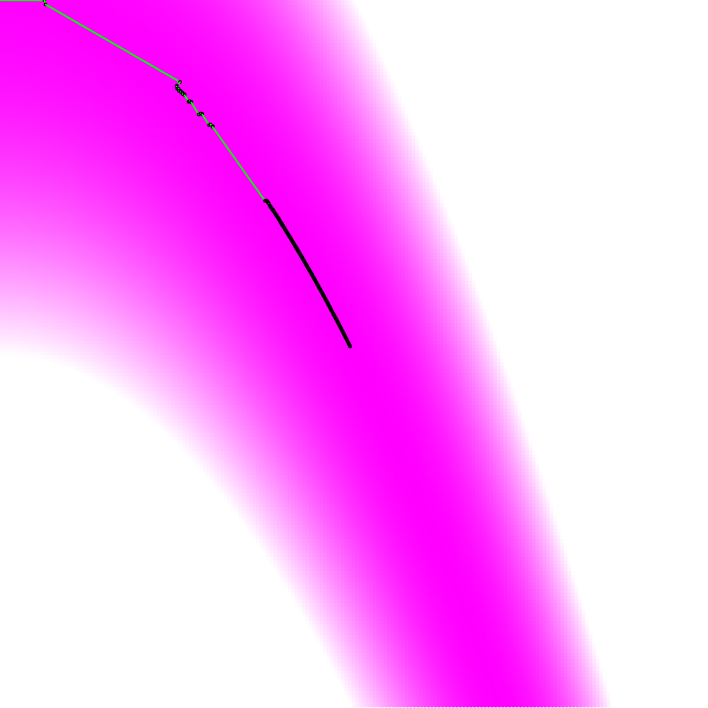

# Work0

After build and run, the graph of `Rosenbrock Fucntion` will show up.



And the terminal shows that `944` iterations, the program finds the optimal result of `X: [0.988934, 0.977946]`

```Bash
--> iterate cnt: 944
g: [-0.00609173, -0.00791834]
X: [0.989217, 0.978446]
```
